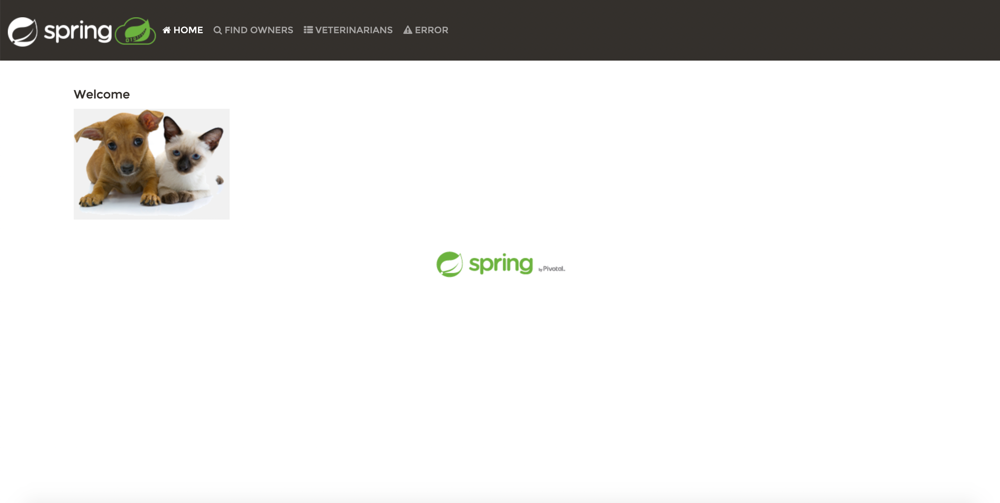
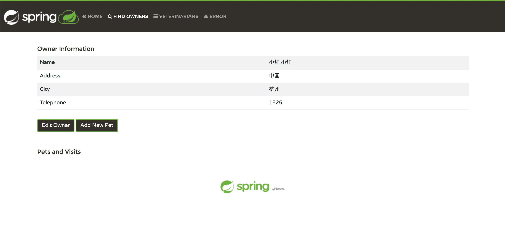
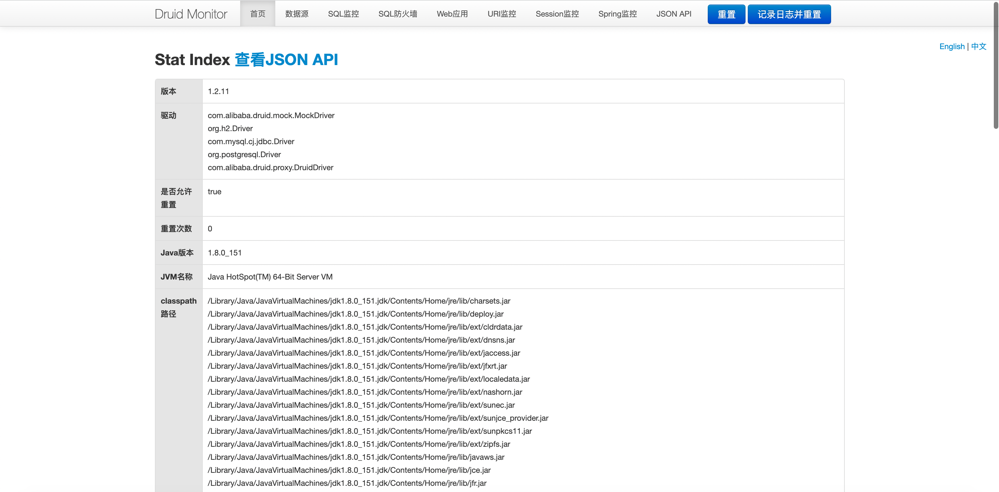
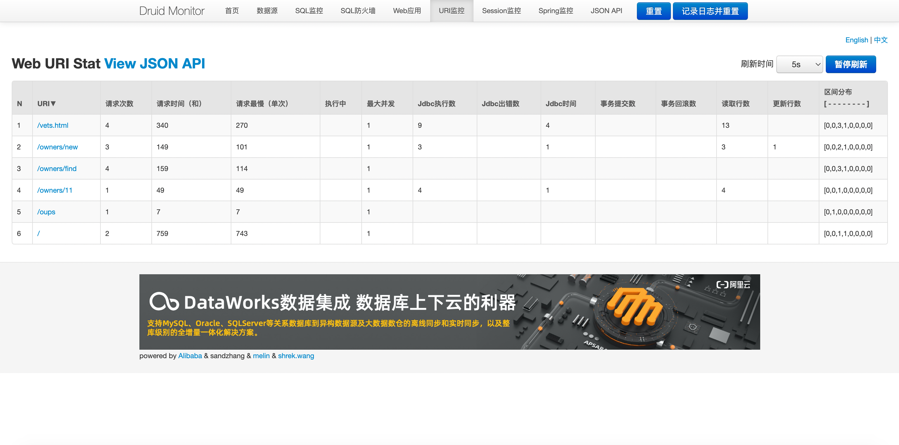

# Spring&Druid PetClinic Sample Application 

Integrate Druid data sources via druid-spring-boot-starter to build Spring PetClinic Sample Application
> About Spring PetClinic see: https://github.com/spring-projects/spring-petclinic

1. Run druid-demo-petclinic/src/main/java/org/springframework/samples/petclinic/PetClinicApplication.java
2. The demo PetClinic system: http://127.0.0.1:8080

3. The Druid stat system: http://127.0.0.1:8080/druid/index.html

4. Try to modify the druid configuration: druid-demo-petclinic/src/main/resources/application.properties
